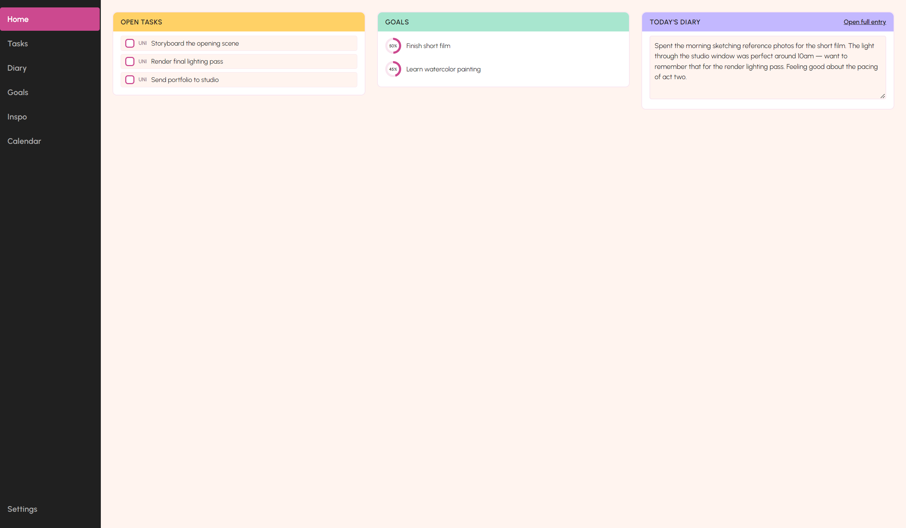
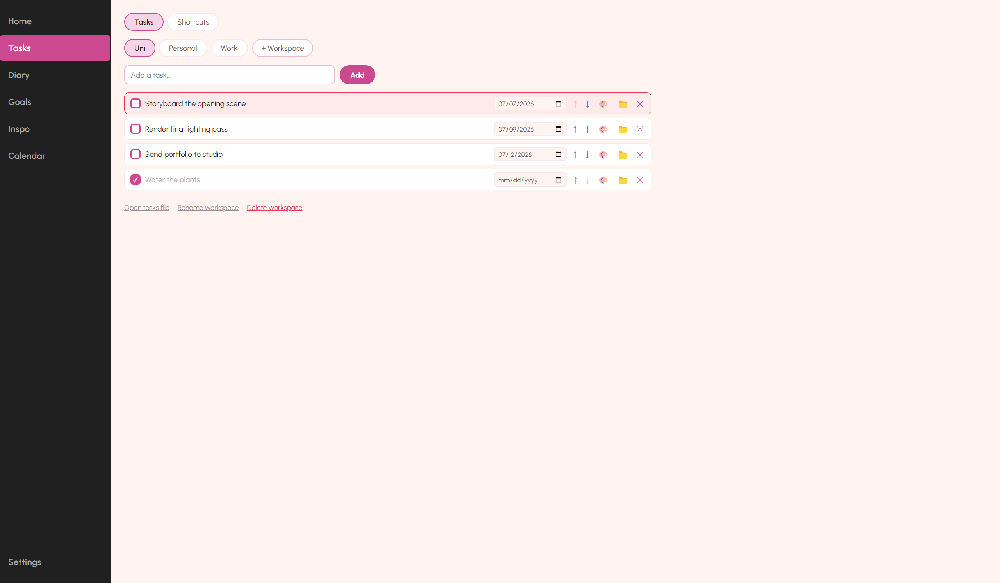
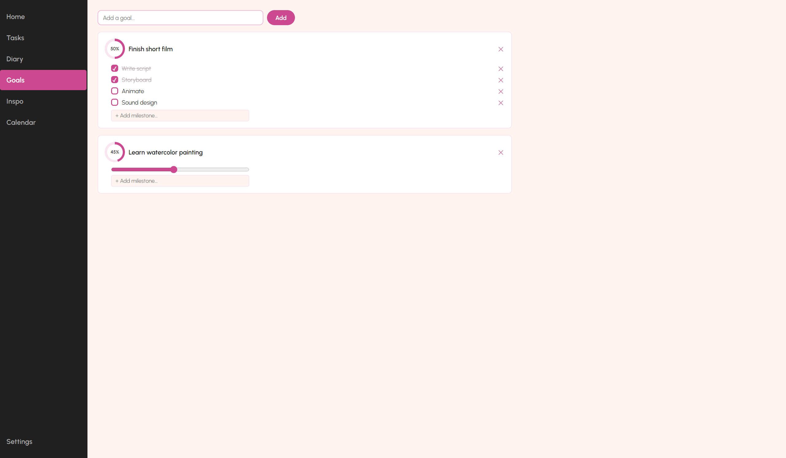
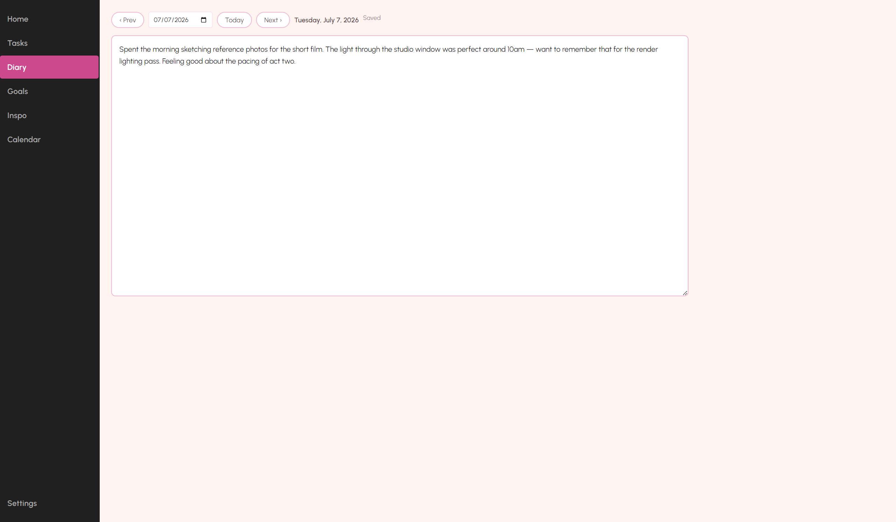
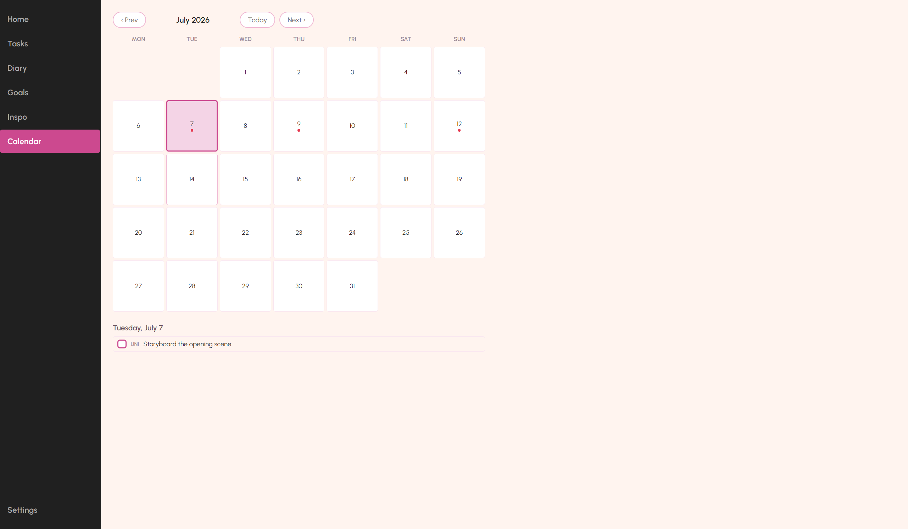
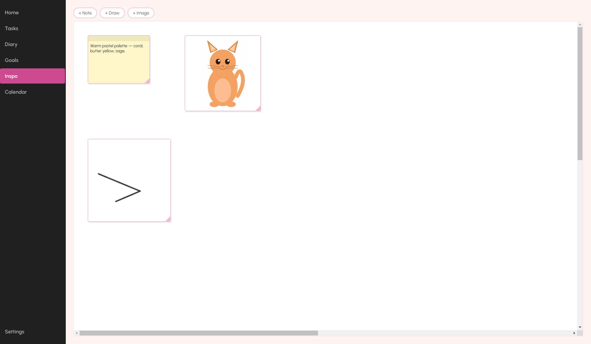

# DeskBuddy

A personal desktop organiser and diary for Windows — a small always-on-top character icon that opens into **Studio**, a full workspace for tasks, a journal, goals, deadlines, and a freeform inspiration board.



## Features

- **Floating character icon** — frameless, always on top, draggable, remembers its position; stays on screen until you close it yourself, and is the quick way to open Studio
- **Home** — a live dashboard of open tasks across every workspace, active goals, and today's diary entry, all directly editable from one screen
- **Multi-workspace Tasks** — split your tasks into named workspaces (Uni / Personal / Work by default; add, rename, or delete your own), each with two-way sync to a plain `.txt` file you can edit in Notepad
- **Deadlines & reminders** — give any task a due date; overdue/due-today tasks are highlighted, and DeskBuddy shows a native Windows notification once a day if anything is due
- **Calendar** — a month view across every workspace's deadlines; click a day to see and check off what's due
- **Diary** — one entry per day, navigate by day or jump to any date
- **Goals** — track progress either via a milestone checklist or a manual progress ring
- **Inspo** — a PureRef-style freeform board for images, sticky notes, and freehand sketches, both as a standalone board and privately per task
- **Folders & Shortcuts** — pin real local folders/files for quick access, organized into folders you create, both as one shared tree and privately per task
- **Characters** — Cat, Dog, Person, Robot built in, or upload a custom image; optionally scheduled to change on a date range
- **System tray** — lives in the tray when closed, right-click to reopen Studio, bring back the icon, or quit

## Screenshots

| | |
|---|---|
|  |  |
|  |  |
|  | |

## Roadmap

Decorative stickers (placeable on tasks/diary entries), a theme picker (starting with a retro Windows-98-style skin alongside the current default), and further Home dashboard enrichment.

## Getting Started

### Prerequisites

- [Node.js](https://nodejs.org/) (v18+)
- Windows 10/11

### Install & Run

```bash
git clone https://github.com/vickussya/DeskBuddy.git
cd DeskBuddy
npm install
npm start
```

Or double-click `start-deskbuddy.bat`.

### First Run

On first launch DeskBuddy creates one `.txt` file per task workspace in:
```
%APPDATA%\deskbuddy\tasks\<workspace-id>.txt
```
e.g. `tasks\uni.txt`, `tasks\personal.txt`, `tasks\work.txt`. Open any of them in Notepad to add tasks — one per line. Changes reload automatically in Studio. Due dates and check state are app-only and aren't reflected in the `.txt` file, so Notepad editing stays simple. If you're upgrading from an older version with a single `tasks.txt`, its contents are imported into the Personal workspace once, and the original file is left untouched.

## Replacing Placeholder Assets

| Asset | Location | Format |
|---|---|---|
| Character images | `src/assets/characters/` | `cat.png`, `dog.png`, `person.png`, `robot.png` |
| Tray icon | `src/assets/tray-icon.png` | 16×16 PNG |

## Tech Stack

- [Electron](https://www.electronjs.org/) v28
- Vanilla HTML / CSS / JavaScript (no frontend framework)
- [chokidar](https://github.com/paulmillr/chokidar) for file watching
- [Urbanist](https://fonts.google.com/specimen/Urbanist) (bundled locally under `src/assets/fonts/`)
- Plain JSON + text files for persistence (no database)

## Project Structure

```
DeskBuddy/
├── main.js                      # Electron main process
├── preload.js                   # Context bridge (IPC)
├── launch.js                    # Launcher (strips ELECTRON_RUN_AS_NODE)
├── src/
│   ├── renderer/
│   │   ├── icon.html/js/css     # Always-on-top character launcher window
│   │   ├── studio.html          # Studio shell (sidebar + panels)
│   │   ├── studio.css
│   │   ├── studio.js            # Bootstrap
│   │   ├── studio-nav.js        # Sidebar section switching
│   │   ├── studio-home.js       # Home dashboard
│   │   ├── studio-tasks.js      # Multi-workspace Tasks + due dates
│   │   ├── studio-diary.js      # Daily journal
│   │   ├── studio-goals.js      # Goals + progress rings
│   │   ├── studio-inspo.js      # Freeform board (standalone + per-task)
│   │   ├── studio-folders.js    # Folders & Shortcuts (unified + per-task)
│   │   ├── studio-calendar.js   # Month view of deadlines
│   │   ├── studio-settings.js   # General / Character / Schedule
│   │   └── theme.css            # CSS-variable palette (swappable via [data-theme])
│   └── assets/
│       ├── characters/          # Character images
│       ├── fonts/               # Bundled Urbanist font files
│       └── tray-icon.png
├── docs/screenshots/            # README screenshots
└── start-deskbuddy.bat          # Windows launcher shortcut
```

## License

MIT
